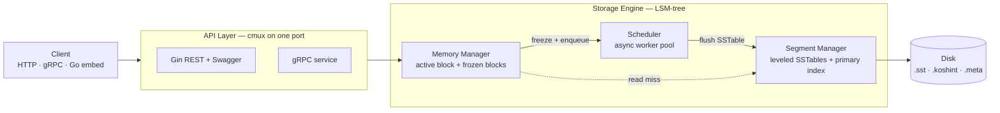
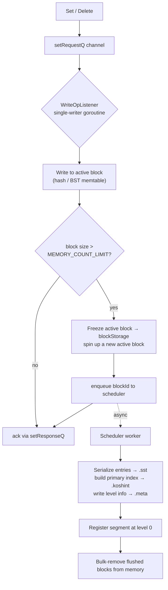
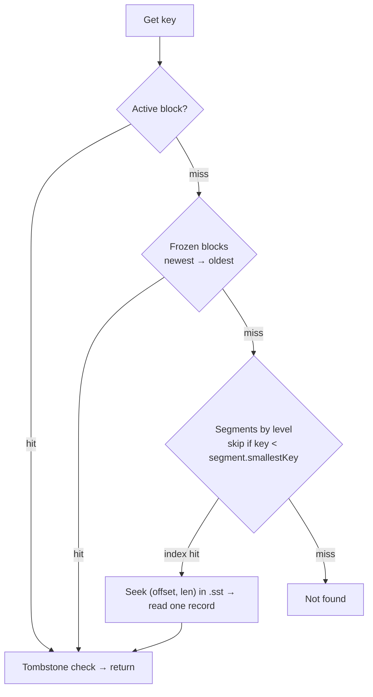
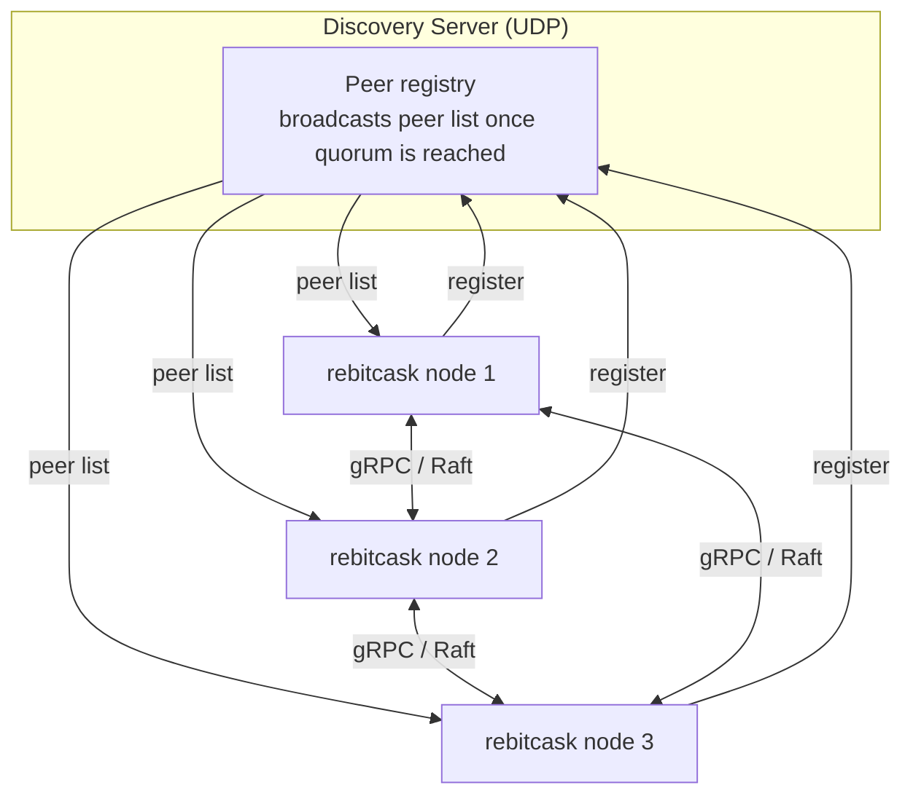

<!-- PROJECT HEADER -->
<div align="center">

# 🗄️ rebitcask

**A Bitcask-inspired key-value store, rebuilt from scratch in Go — on its way to becoming a distributed K/V database.**

An LSM-tree storage engine with in-memory memtables, asynchronous SSTable flushing, and per-segment primary indexes — wrapped in an HTTP + gRPC server, and growing a Raft-based cluster layer.

<br/>

[](https://github.com/lochuhsin/bitcask/actions/workflows/test_go.yml)


<br/>

`gin` &nbsp;·&nbsp; `gRPC` &nbsp;·&nbsp; `cmux` &nbsp;·&nbsp; `swagger` &nbsp;·&nbsp; `raft (in progress)`

</div>

---

<!-- TABLE OF CONTENTS -->
<details>
  <summary><b>Table of Contents</b></summary>
  <ol>
    <li><a href="#about-the-project">About The Project</a></li>
    <li><a href="#features">Features</a></li>
    <li><a href="#architecture">Architecture</a>
      <ul>
        <li><a href="#high-level-overview">High-Level Overview</a></li>
        <li><a href="#write-path">Write Path</a></li>
        <li><a href="#read-path">Read Path</a></li>
        <li><a href="#on-disk-format">On-Disk Format</a></li>
        <li><a href="#cluster-mode">Cluster Mode</a></li>
      </ul>
    </li>
    <li><a href="#getting-started">Getting Started</a>
      <ul>
        <li><a href="#prerequisites">Prerequisites</a></li>
        <li><a href="#embed-as-a-library">Embed as a Library</a></li>
        <li><a href="#run-as-a-server">Run as a Server</a></li>
        <li><a href="#run-as-a-cluster">Run as a Cluster</a></li>
      </ul>
    </li>
    <li><a href="#http-api">HTTP API</a></li>
    <li><a href="#configuration">Configuration</a></li>
    <li><a href="#project-structure">Project Structure</a></li>
    <li><a href="#benchmarking--profiling">Benchmarking & Profiling</a></li>
    <li><a href="#roadmap">Roadmap</a></li>
    <li><a href="#license">License</a></li>
    <li><a href="#contact">Contact</a></li>
  </ol>
</details>

---

<!-- ABOUT THE PROJECT -->
## About The Project

As a backend / ML engineer, I have worked with many kinds of databases — SQL and NoSQL, key-value, document, read-heavy and write-heavy. But I never had the chance to really understand what happens *inside* them: indexing, search, caching, versioning, and distributing data across nodes.

So I decided to build one myself — starting from the simplest design, the **[Bitcask](https://riak.com/assets/bitcask-intro.pdf)** log-structured key-value store, and gradually evolving it into a distributed K/V store.

This is an **educational project**, but the goal is to make it as robust and realistic as I can: real concurrency, real disk layout, real failure scenarios.

### Design Goals

| Goal | Approach |
| --- | --- |
| 🔑 **Key-value storage** | Simple `Get` / `Set` / `Delete` semantics |
| ✍️ **Write-heavy workloads** | Append-only writes; flush to immutable SSTables |
| 💾 **Data larger than memory** | Memtable + on-disk segments (data ≈ 10× memory) |
| 🔁 **Crash recovery** | Commit log + on-disk index hints *(in progress)* |
| 🌐 **Distributed storage** | Discovery server + gRPC + Raft *(in progress)* |

> **Note:** Most core building blocks — SSTables, segment files, the primary index, the in-memory data structures — are implemented from the ground up rather than pulled from a library. Reinventing the wheel, on purpose. 🛞

---

## Features

- **LSM-tree storage engine** — writes land in an in-memory *memtable* and are flushed asynchronously to immutable, sorted on-disk segments.
- **Pluggable memtable** — choose between a **hash map** (`hash`) or a **binary search tree** (`bst`) backend per deployment.
- **Bitcask-style primary index** — each segment keeps a `key → (offset, length)` map, so reads seek directly to the byte range instead of scanning the file.
- **LevelDB-style segments** — segments are organized into levels, and each carries its smallest key so lookups can skip files that can't contain the target.
- **Asynchronous flush scheduler** — a worker pool drains frozen memtable blocks to disk without blocking writes.
- **Single-writer concurrency** — writes are serialized through one goroutine over channels; reads run concurrently under a read lock.
- **HTTP + gRPC on one port** — [`cmux`](https://github.com/soheilhy/cmux) multiplexes REST (Gin), gRPC, and raw TCP over a single listener.
- **Swagger UI** — auto-generated API docs at `/swagger/index.html`.
- **Embeddable** — use it directly as a Go library via the package-level `Get` / `Set` / `Delete` API.
- **Cluster scaffolding** — a UDP discovery server and a Raft node skeleton for the distributed roadmap.

---

## Architecture

### High-Level Overview



The engine has three cooperating components:

| Component | Responsibility |
| --- | --- |
| **Memory Manager** | Holds the mutable *active block* (memtable) plus an ordered list of *frozen blocks* waiting to be flushed. Serializes all writes through a single listener goroutine. |
| **Scheduler** | A worker pool that picks up frozen blocks and persists them to disk as SSTable + index + metadata files, then evicts them from memory. |
| **Segment Manager** | Tracks on-disk SSTable segments across levels (LevelDB-style) and resolves reads via each segment's primary index. |

### Write Path



Writes always hit memory first and are acknowledged immediately. When the active block grows past `MEMORY_COUNT_LIMIT`, it's frozen and a fresh block takes over, so writes never stall waiting for disk. Deletes are recorded as **tombstones** — a sentinel value that shadows the key until compaction reclaims it.

### Read Path



A read walks the hierarchy newest-to-oldest: active block → frozen blocks → on-disk segments. Within the segments, each one stores its **smallest key**, so any segment that can't possibly hold the target is skipped. On a candidate segment, the **primary index** turns the lookup into a single `seek + read` instead of a full file scan.

### On-Disk Format

Each record is serialized as a `::`-delimited line and written into an append-only segment file:

```text
CRC :: Timestamp :: KeyLen :: Key :: ValueLen :: Value
```

A segment is materialized as three sibling files:

| File | Extension | Contents |
| --- | --- | --- |
| **Segment** | `.sst` | The sorted records themselves (the SSTable) |
| **Index hint** | `.koshint` | `key → offset::length` map for direct seeks |
| **Metadata** | `.meta` | Segment level (used by the planned compaction) |

### Cluster Mode



In cluster mode, each node registers with a standalone **UDP discovery server**. Once the configured member count is reached, the discovery server broadcasts the peer list back to every node, which then form a cluster and communicate over gRPC. The **Raft** layer (leader election + log replication) is currently a work-in-progress skeleton.

---

## Getting Started

### Prerequisites

- **Go 1.21+**
- **Docker** & **Docker Compose** *(only needed for the server / cluster setups)*
- **`make`**

The build step also installs [`swag`](https://github.com/swaggo/swag) for Swagger generation:

```sh
make init
```

### Embed as a Library

The simplest way to use rebitcask — import it and call the package-level API (see [`endpoint.go`](endpoint.go)):

```go
package main

import (
    "fmt"

    "rebitcask"
)

func main() {
    // Initialize the engine (loads config, sets up dirs, starts goroutines).
    // Optionally pass paths to .env files.
    rebitcask.Setup()

    // Write
    rebitcask.Set("user:1", "alice")

    // Read
    if val, ok := rebitcask.Get("user:1"); ok {
        fmt.Println(val) // alice
    }

    // Delete (writes a tombstone)
    rebitcask.Delete("user:1")

    if _, ok := rebitcask.Get("user:1"); !ok {
        fmt.Println("gone")
    }
}
```

### Run as a Server

```sh
# Build (generates Swagger docs) and run locally
make run

# …or run inside a container
make compose-up      # start
make compose-down    # stop
```

Once running:

- REST API → `http://localhost:8080/core`
- Swagger UI → `http://localhost:8080/swagger/index.html`
- Health check → `http://localhost:8080/healthz`

### Run as a Cluster

Spins up the discovery server plus three rebitcask nodes via Docker Compose:

```sh
make cluster-build   # build all images
make cluster-up      # start discovery + nodes
make cluster-down    # tear everything down
```

---

## HTTP API

All key-value operations live under the `/core` route group ([`api/core/routes.go`](api/core/routes.go)):

| Method | Endpoint | Description | Body / Query |
| --- | --- | --- | --- |
| `GET` | `/core?key=<key>` | Fetch a value by key | `key` query param |
| `POST` | `/core` | Insert a key/value | `{ "key": "...", "value": "..." }` |
| `PATCH` | `/core` | Update a key/value | `{ "key": "...", "value": "..." }` |
| `DELETE` | `/core` | Delete a key | `{ "key": "..." }` |

```sh
# Set
curl -X POST localhost:8080/core -H 'Content-Type: application/json' \
     -d '{"key":"hello","value":"world"}'

# Get
curl "localhost:8080/core?key=hello"

# Delete
curl -X DELETE localhost:8080/core -H 'Content-Type: application/json' \
     -d '{"key":"hello"}'
```

> `*/sync` and `*/watch` routes exist as placeholders for cluster-aware, synchronous operations and are **not yet implemented**.

---

## Configuration

Configuration is loaded from `.env` files (passed via the `-envfiles` flag) with sensible defaults ([`internal/setting/config.go`](internal/setting/config.go)):

| Variable | Default | Description |
| --- | --- | --- |
| `DATA_FOLDER_PATH` | `./rbData/` | Root directory for segment, index, and commit-log files |
| `MEMORY_MODEL` | `hash` | Memtable backend: `hash` or `bst` |
| `MEMORY_COUNT_LIMIT` | `1000000` | Entries per memtable block before it's frozen and flushed |
| `SEGMENT_FILE_COUNT_LIMIT` | `100` | Segment count threshold for compaction *(planned)* |
| `TOMBSTONE` | `!@#$%^&*()_+` | Sentinel marking a deleted key |
| `PORT` | `:8080` | Server listen port (HTTP + gRPC multiplexed) |
| `MODE` | `standalone` | `standalone` or `cluster` |
| `SERVER_ID` | random UUID | Node identity used for cluster registration |
| `CLUSTER_SETUP_HOST` | `discovery-app:9000` | Address of the discovery server |

The discovery server has its own config ([`discovery/setting/config.go`](discovery/setting/config.go)):

| Variable | Default | Description |
| --- | --- | --- |
| `CLUSTER_MEMBER_COUNT` | `3` | Members to wait for before broadcasting the peer list |
| `UDP_SERVER_PORT` | `:9000` | UDP port the discovery server listens on |

---

## Project Structure

```text
rebitcask/
├── endpoint.go            # Public library API: Get / Set / Delete
├── initalize.go           # Engine bootstrap (Setup)
├── cmd/                   # Server entrypoint: cmux, HTTP, gRPC, UDP, flags
├── api/                   # Gin HTTP handlers (core / chore / cluster)
├── internal/
│   ├── memory/            # Memtable: blocks, hash & BST backends, manager
│   ├── segment/           # SSTable segments, primary index, segment manager
│   ├── scheduler/         # Async flush worker pool + file I/O
│   ├── dao/               # Entry model + record serialization
│   ├── setting/           # Config & constants
│   └── util/              # byte/string conversion, path helpers
├── server/                # gRPC protobuf definitions & generated code
├── raft/                  # Raft node skeleton (WIP)
├── discovery/             # Standalone UDP discovery server
├── deployment/            # Dockerfiles
├── bench/ · test/         # Benchmarks & functional tests
└── docs/                  # Generated Swagger docs
```

---

## Benchmarking & Profiling

```sh
make test              # run all tests with the race detector
make test-concurrent   # parallel test run
make test-timeout      # benchmarks with a timeout guard
```

The [`bench/`](bench/) suite exercises `Get` / `Set` / `Delete` across various key counts, with built-in pprof profiling:

```sh
make all_profile       # run benchmarks, emit cpu/mem/block profiles
make cpu_profile       # open the CPU profile in pprof's web UI
make mem_profile       # open the memory profile in pprof's web UI
```

---

## Roadmap

**Storage engine**

- [x] Basic `Get` / `Set` / `Delete`
- [x] Vanilla hash-map key-value storage
- [x] Segment storage
- [x] SSTable (Sorted String Table)
- [x] Binary Search Tree memtable backend
- [x] Asynchronous flush task pool
- [x] Primary index for segments
- [ ] Red-Black Tree memtable backend
- [ ] Segment compaction (level merging)
- [ ] Graceful shutdown & crash recovery
- [ ] Range-based key queries

> A Bloom filter + read cache was prototyped and dropped — likely to return at the segment level.

**Distributed layer**

- [x] gRPC transport for inter-node communication
- [x] UDP discovery server
- [ ] Raft consensus (leader election + log replication)
- [ ] Synchronous, cluster-aware write APIs

**Quality**

- [ ] Broader test coverage per package

---

## License

Distributed under the **MIT License**. See [`LICENSE`](LICENSE) for details.

---

## Contact

**Chuhsin Lo**

[](mailto:lochuhsin@gmail.com)
[](https://www.linkedin.com/in/lochuhsin/)

<div align="center"><sub>Built as a journey to understand databases from the inside out.</sub></div>
